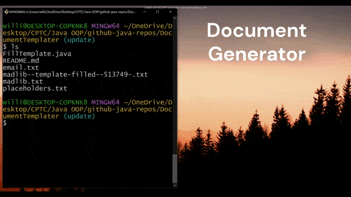
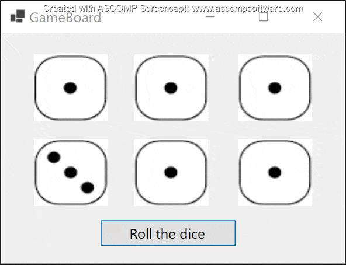
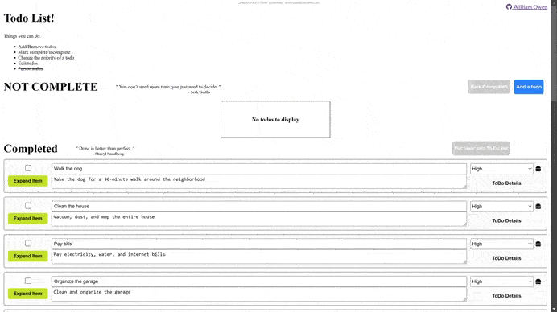
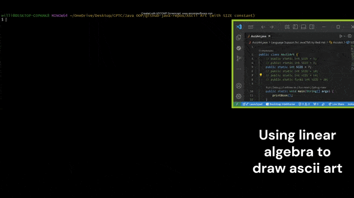

## 🗺️ Mapping & Visual Projects

  

<em style="test">A real-time geographic pin mapping visualization project.</em>

---

## 📚 Desktop Apps

  
  

  

---

## 📱 Mobile Apps

  
  

---

## 🎨 Personal / Art Projects

  
  

---

## 💻 Web & Dev Tools

  
  

